# 08 - Messagerie interne avec iRedMail

## 1. Objectif

Cette étape consiste à mettre en place un service de messagerie interne pour l’entreprise **EcoTech Solutions**.

La solution retenue est **iRedMail**, installée sur le serveur Linux `SRVLX01`, déjà utilisé pour GLPI. L’objectif est de disposer d’une messagerie interne fonctionnelle sur le domaine `ecotechsolutions.lan`.

Le service permet :

- d’administrer un domaine mail interne ;
- de créer des boîtes mail utilisateurs ;
- d’accéder au webmail via Roundcube ;
- d’administrer les comptes via iRedAdmin ;
- de tester l’envoi et la réception de mails entre deux utilisateurs internes.

## 2. Contexte technique

| Élément | Valeur |
|---|---|
| Serveur | SRVLX01 |
| Adresse IP | 10.0.10.20 |
| Domaine AD/DNS | ecotechsolutions.lan |
| FQDN serveur | srvlx01.ecotechsolutions.lan |
| Alias DNS mail | mail.ecotechsolutions.lan |
| Solution mail | iRedMail |
| Webmail | Roundcube |
| Administration | iRedAdmin |
| Serveur SMTP | Postfix |
| Serveur IMAP/POP3 | Dovecot |
| Serveur web iRedMail | Nginx |
| Serveur web GLPI | Apache |

Le FQDN du serveur a été vérifié avant l’installation.

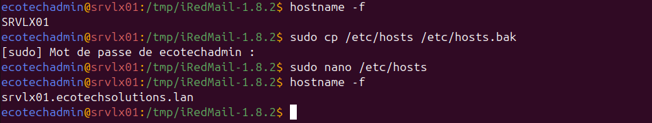

## 3. Configuration DNS

Deux enregistrements DNS ont été ajoutés dans la zone directe `ecotechsolutions.lan`.

| Type | Nom | Valeur |
|---|---|---|
| A | mail.ecotechsolutions.lan | 10.0.10.20 |
| MX | ecotechsolutions.lan | mail.ecotechsolutions.lan |

L’enregistrement **A** permet de résoudre `mail.ecotechsolutions.lan` vers l’adresse IP de `SRVLX01`.

L’enregistrement **MX** indique que le serveur chargé de recevoir les mails du domaine `ecotechsolutions.lan` est `mail.ecotechsolutions.lan`.

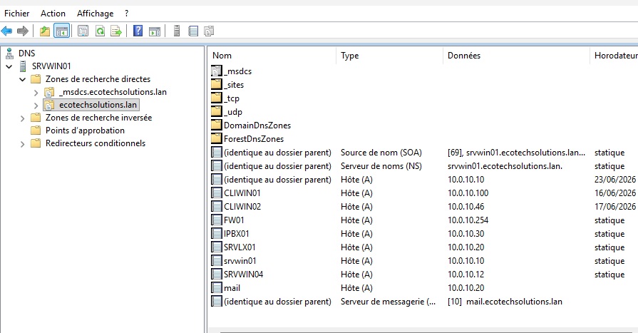

La résolution DNS a été vérifiée avec `nslookup`.

```powershell
nslookup mail.ecotechsolutions.lan
nslookup -type=mx ecotechsolutions.lan
```

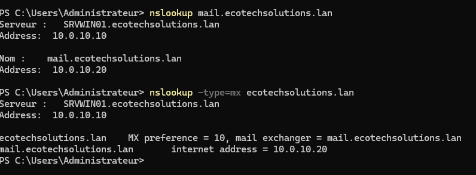

## 4. Installation d’iRedMail

iRedMail a été installé sur `SRVLX01`.

Les choix principaux de l’assistant d’installation sont les suivants :

| Paramètre | Choix |
|---|---|
| Répertoire de stockage mail | /var/vmail |
| Backend des comptes mail | MariaDB |
| Serveur web | Nginx |
| Domaine mail | ecotechsolutions.lan |
| Administrateur du domaine | postmaster@ecotechsolutions.lan |
| Composants | Roundcube, iRedAdmin, Fail2ban |

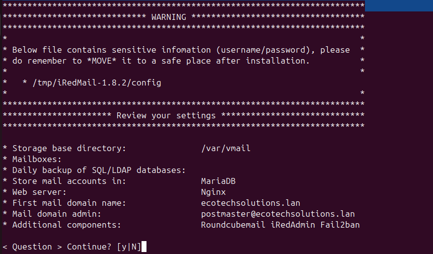

L’installation s’est terminée correctement. Les informations sensibles affichées à l’écran ont été masquées avant intégration dans la documentation.

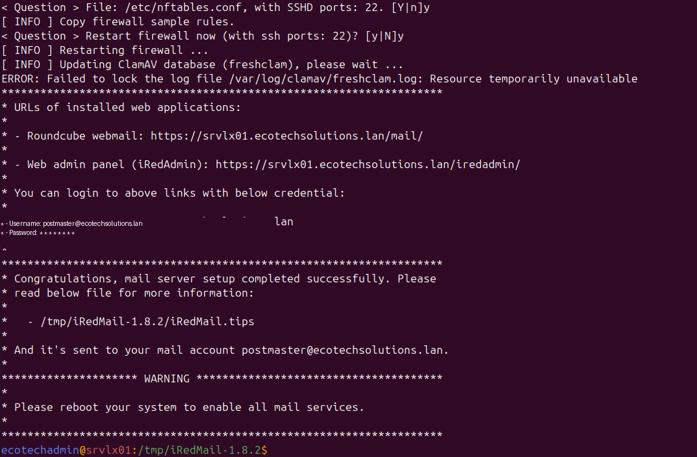

## 5. Coexistence GLPI et iRedMail sur SRVLX01

Avant l’installation d’iRedMail, GLPI utilisait Apache sur le port `80`.

iRedMail installe Nginx pour fournir les interfaces web Roundcube et iRedAdmin. Nginx utilise les ports standards du web :

| Port | Usage |
|---|---|
| 80 | HTTP |
| 443 | HTTPS |

Deux services ne peuvent pas écouter simultanément sur la même IP et le même port.

Pour éviter le conflit entre Apache et Nginx, GLPI a été déplacé sur le port `8080`.

Configuration finale :

| Service | Rôle | Ports |
|---|---|---|
| Nginx | Roundcube / iRedAdmin | 80 / 443 |
| Apache | GLPI | 8080 |
| Postfix | SMTP | 25 / 587 |
| Dovecot | IMAP | 143 / 993 |

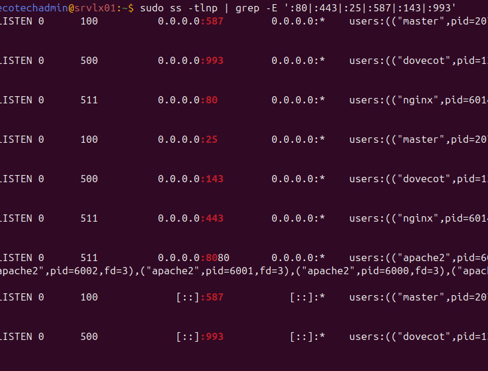

Les URLs finales sont donc :

```text
Roundcube : https://10.0.10.20/mail/
iRedAdmin : https://10.0.10.20/iredadmin/
GLPI      : http://10.0.10.20:8080/
```

## 6. Difficulté rencontrée : blocage du port 8080 par nftables

Après le déplacement de GLPI sur le port `8080`, le service répondait localement sur `SRVLX01`, mais il restait inaccessible depuis un client Windows.

Le test réseau côté client montrait que le serveur était joignable, mais que le port `8080` était bloqué.

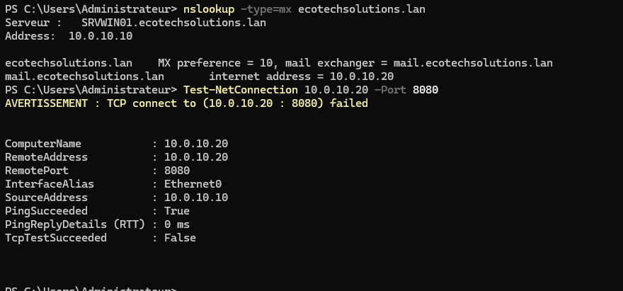

L’analyse des règles `nftables` a montré que les ports standards de messagerie étaient autorisés, mais pas le port `8080` utilisé par GLPI.

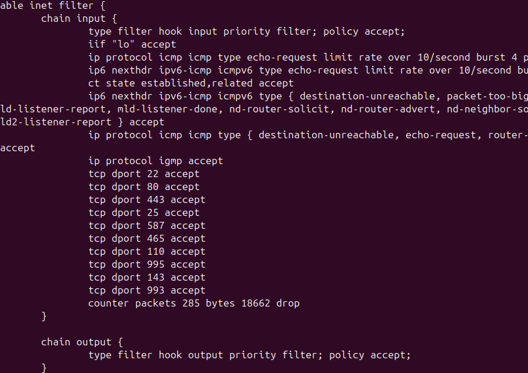

La correction a consisté à ajouter une règle d’autorisation pour le port `8080` dans `/etc/nftables.conf`, avant la règle de blocage finale.

```text
tcp dport 8080 accept
```

Après rechargement de nftables, GLPI est redevenu accessible depuis le LAN via :

```text
http://10.0.10.20:8080/
```

## 7. Interfaces web iRedMail

L’interface d’administration iRedAdmin est accessible depuis le réseau local.

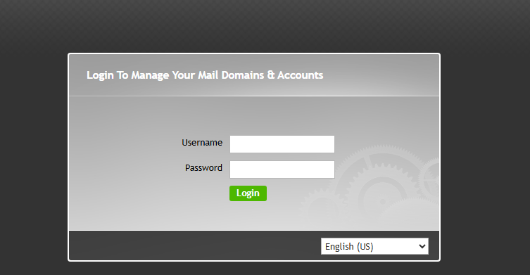

Le webmail Roundcube est également accessible.

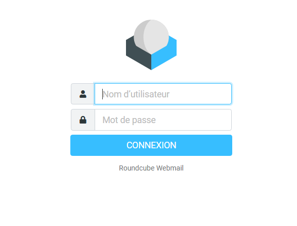

## 8. Création des boîtes mail

Deux boîtes mail ont été créées pour tester la messagerie interne.

| Utilisateur | Adresse mail |
|---|---|
| Lucas Bernard | lucas.bernard@ecotechsolutions.lan |
| Léa Petit | lea.petit@ecotechsolutions.lan |

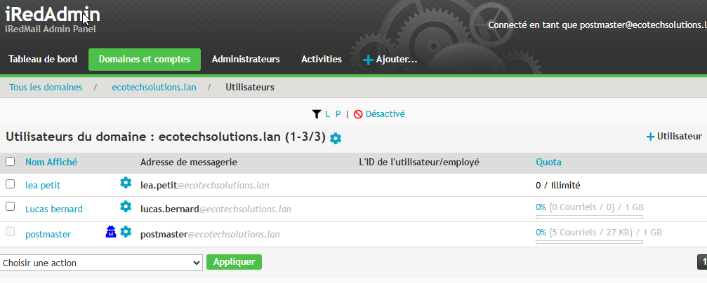

## 9. Test d’envoi et de réception

Un test d’envoi a été réalisé depuis le compte de Lucas Bernard vers le compte de Léa Petit.

```text
Expéditeur   : lucas.bernard@ecotechsolutions.lan
Destinataire : lea.petit@ecotechsolutions.lan
Objet        : Bonjour Lea !
```

Le message a bien été reçu dans la boîte de réception de Léa via Roundcube.

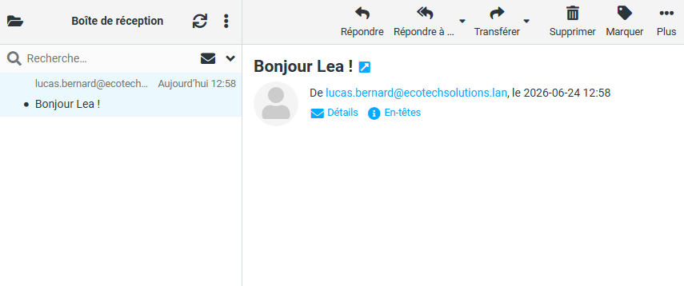

## 10. Résultat final

La messagerie interne est fonctionnelle.

Les points validés sont :

- résolution DNS de `mail.ecotechsolutions.lan` ;
- enregistrement MX du domaine `ecotechsolutions.lan` ;
- installation d’iRedMail sur `SRVLX01` ;
- accès à iRedAdmin ;
- accès à Roundcube ;
- création des boîtes mail utilisateurs ;
- envoi et réception d’un mail interne ;
- coexistence de GLPI et iRedMail sur le même serveur ;
- correction du blocage nftables sur le port `8080`.

## 11. Améliorations possibles

Plusieurs améliorations peuvent être envisagées :

- mettre en place un certificat TLS interne signé par une autorité de certification ;
- renforcer les mots de passe des comptes mail ;
- documenter davantage les règles nftables ;
- superviser les services Postfix, Dovecot, Nginx et MariaDB ;
- séparer GLPI et la messagerie sur deux serveurs distincts dans une infrastructure de production.
