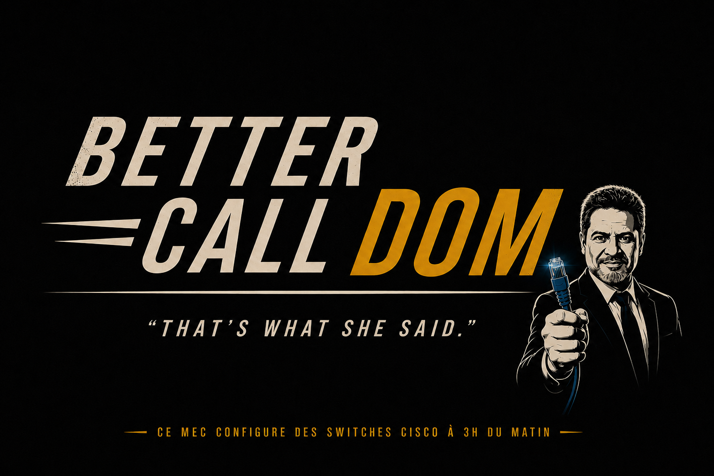

# TSSR-0226-P3-G2-Build-Your-Infra

### Projet à réalisé dans le cadre de notre formation TSSR. 

# I. Le Projet 

L'objectif de ce projet est la conception, la mise en place et la documentation complète d'une infrastructure réseau pour le compte d'une société fictive, EcoTech Solutions. 

Le projet est découpé en sprint d'une ou deux semaines étalé sur dix semaines au total. 

## **a) L'entreprise:**

**EcoTech Solutions**, implantée à Bordeaux, est un acteur innovant dans le domaine des solutions IoT dédiées à la gestion
intelligente de l’énergie et des ressources. L’entreprise rassemble aujourd’hui 245 talents, répartis au sein de 7 départements spécialisés, et s’enrichit régulièrement de compétences extérieures, intervenant sur des missions ponctuelles ou à temps plein.

## **b) Situation actuelle:**

Au vu de l'infrastructure actuelle, sécurité quasi inexistante, réseau unique (172.16.20.0/24) basé sur une box FAI et des répéteurs WIFI, stockage des données fait manière rudimentaire en violation potentielle du RGPD au risque de sanction administratif.

Il est donc impératif de procéder au déploiement d'une nouvelle infrastructure from scratch, afin d'être en conformité et de répondre aux enjeux de croissance.

## **c) Objectif de l'implémentation :**

Mettre en place une nouvelle infrastructure en suivant une méthodologie agile et en respectant les bonnes pratiques d’architecture, de sécurité et de documentation. 

# II. Types de documentations 
  
Définition des types de documents attendue:   

- DAT : Documentation d'Architecture Technique, Vue d'ensemle du Propjet, pas de technique > 'README'  
- HLD : High Level Design, Infra pensée globalement, sans détails de config                 > 'architecture'  
- LLD : Low Level Design, Détails techniques de chaque composant                            > 'components'  
- DEX : Documentation d'Exploitation, utilisation quotidienne de l'infrastructure           > 'operation'   

# III. **Le groupe de projet :**  

**Société BCD :**   

    
En tant que prestataire mandaté par EcoTech Solutions, notre équipe de 3 personnes à pour mission de déployer une nouvelle infrastructure réseau. Les rôles de Product Owner, Scrum Master et Technicien sont tournants à chaque sprint.

DSI : Dominique Colleville

| Sprint    | Product Owner (PO) | Scrum Master (SM) | Technicien | Objectifs |
| --------- | ------------------ | ----------------- | ---------- | --------- |
| Sprint 1  | Grégory            | Zinédine          | Zishan     |  Analyse et planification         |
| Sprint 2  |                    |                   |            |           |
| Sprint 3  |                    |                   |            |           |
| Sprint 4  |                    |                   |            |           |
| Sprint 5  |                    |                   |            |           |
| Sprint 6  |                    |                   |            |           |
| Sprint 7  |                    |                   |            |           |
| Sprint 8  |                    |                   |            |           |
| Sprint 9  |                    |                   |            |           |
| Sprint 10 |                    |                   |            |           |
| Sprint 11 |                    |                   |            |           |

# IIII. Listing matériel - Équipements réseau (Packet Tracer)
|#| Nom PT | Modèle Packet Tracer | Rôle | IP de gestion |
|---|-------|----------------------|-----|---------------|
| 1 | FW-DSI-001 | Routeur Cisco 4331 | Simulation pfSense - NAT, filtrage, routage WAN |  |
| 2 | SW-L3-DSI-001 | Switch Cisco 3650-24PS | Routing inter-VLAN, trunk vers L2 et zone serveurs | |
| 3 | SW-L2-DSI-001 | Switch Cisco 2960-24TT | Accès utilisateurs, ports access par VLAN ||

### Postes clients (1 par VLAN)

| Nom PT | VLAN | IP | Rôle |
|--------|------|----|------|
| PC-DIR-001 | 10 | 172.16.10.10 | VLAN Direction |
| PC-DSI-001 | 20 | 172.16.20.10 | VLAN DSI |
| PC-COM-001 | 30 | 172.16.30.10 | VLAN Communication |
| PC-DEV-001 | 40 | 172.16.40.10 | VLAN Développement |
| PC-DRH-001 | 50 | 172.16.50.10 | VLAN RH |
| PC-FIN-001 | 60 | 172.16.60.10 | VLAN Finance |
| PC-VTE-001 | 70 | 172.16.70.10 | VLAN Commercial |

---
## Listing matériel — Machines virtuelles (VMs)

### Serveurs

| # | Nom VM | Fonction / Rôle | OS | CPU | RAM | Disque | IP |
|---|--------|----------------|----|------|-----|--------|----|
| 1 | VM-DSI-DC1 | Contrôleur de domaine principal - AD DS, DNS, DHCP, NPS | Windows Server 2022 | 2 | 4 Go | 60 Go | 172.16.80.10 |
| 2 | VM-DSI-DC2 | Contrôleur de domaine secondaire - AD DS, DNS (redondance) | Windows Server 2022 | 2 | 4 Go | 60 Go | 172.16.80.11 |
| 3 | VM-DSI-FICHIERS | Serveur de fichiers - Partages réseau DFS | Windows Server 2022 | 2 | 4 Go | 100 Go | 172.16.80.20 |
| 4 | VM-DSI-BAREOS | Serveur de sauvegarde - BareOS (backup unidirectionnel) | Debian 12 | 1 | 2 Go | 200 Go | 172.16.90.10 |
