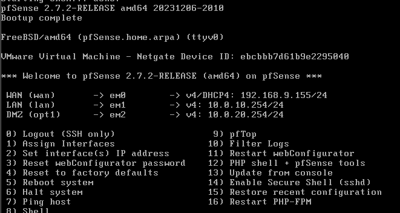
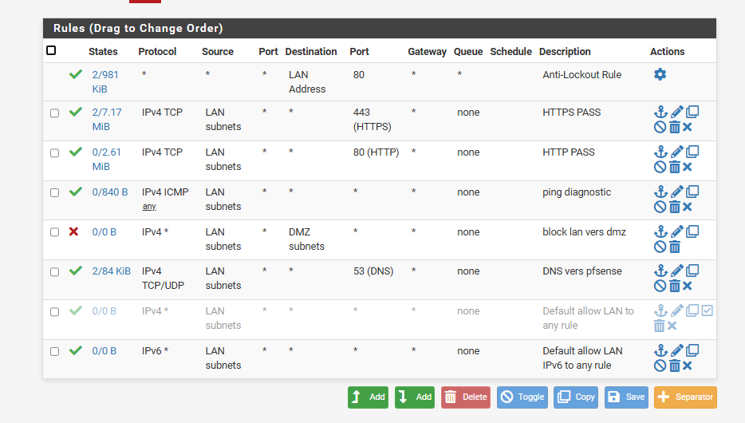
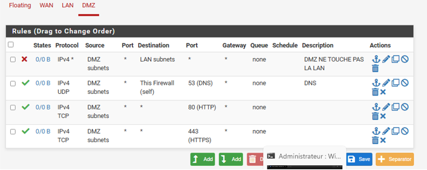

# 01 - pfSense - FW01

`FW01` est le point d'entrée réseau du lab. Il remplace la box Internet dans la logique de l'entreprise et sert à la fois de routeur et de pare-feu. Son rôle est de séparer les flux entre Internet, le réseau interne et la DMZ.

Dans ce projet, je n'ai pas utilisé de VLAN. La séparation est faite avec plusieurs interfaces réseau virtuelles dans VMware. C'est plus simple à mettre en place dans un lab solo et cela reste cohérent avec l'objectif principal : isoler les zones et contrôler les communications.

## Interfaces configurées

| Interface pfSense | Nom système | Adresse | Utilisation |
|---|---|---:|---|
| WAN | em0 | DHCP VMware, 192.168.9.155/24 sur la capture | Sortie Internet du lab |
| LAN | em1 | 10.0.10.254/24 | Passerelle du réseau interne |
| DMZ | em2 | 10.0.20.254/24 | Passerelle de la zone DMZ |

Cette capture est importante parce qu'elle valide le découpage réseau à la base du projet. Le WAN récupère une adresse dans le réseau NAT VMware. Le LAN et la DMZ ont chacun une passerelle dédiée sur pfSense. Les machines internes du LAN utilisent `10.0.10.254` pour sortir de leur réseau. Les machines de la DMZ utilisent `10.0.20.254`.

## Règles appliquées sur le LAN

Sur le LAN, plusieurs flux ont été ouverts pour permettre les tests et l'exploitation de l'infrastructure. On voit notamment des autorisations HTTP, HTTPS, ICMP pour le diagnostic, ainsi qu'une règle DNS sur le port 53. La règle DNS est utile parce que les machines internes doivent pouvoir résoudre les noms nécessaires à leur fonctionnement.

La capture montre aussi une règle de blocage vers la DMZ. C'est un point à surveiller sur pfSense : les règles sont lues de haut en bas. Une règle d'autorisation placée au-dessus d'une règle de blocage peut prendre le dessus. Cette capture sert donc aussi à garder une trace de l'ordre réel des règles et à vérifier que la politique de filtrage reste cohérente avec l'objectif de sécurité.

## Règles appliquées sur la DMZ

La DMZ est configurée de manière plus restrictive. La première règle bloque les flux de la DMZ vers les sous-réseaux du LAN. C'est le comportement attendu : un serveur placé en DMZ ne doit pas pouvoir accéder librement au réseau interne.

Les règles suivantes ouvrent uniquement des services précis. Le DNS est autorisé vers le pare-feu sur le port 53, et les flux HTTP et HTTPS sont présents pour les besoins web. Cette logique correspond au principe du filtrage par défaut : on bloque ce qui n'est pas nécessaire et on autorise uniquement les services utiles.

## Résultat obtenu

À ce stade, pfSense assure trois fonctions :

- passerelle du LAN avec `10.0.10.254` ;
- passerelle de la DMZ avec `10.0.20.254` ;
- filtrage entre les zones réseau.

Le point le plus important à retenir est que le LAN et la DMZ ne sont pas dans le même espace réseau. Si un service placé en DMZ est compromis, le filtrage doit empêcher un accès direct au LAN.

## Points de contrôle

Pour vérifier, je contrôle principalement l'adresse des interfaces, l'ordre des règles et la présence d'une règle de blocage entre la DMZ et le LAN. Les tests réseau se font ensuite depuis les serveurs et clients avec des commandes comme `ping`, `ipconfig` ou `nslookup`.
