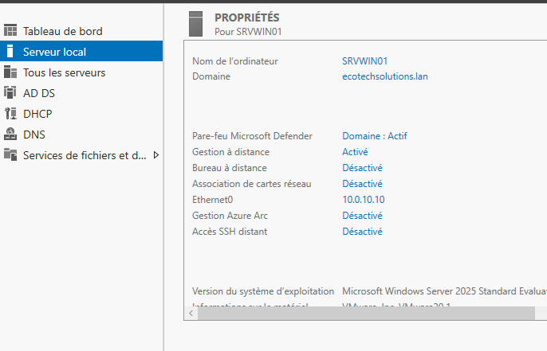
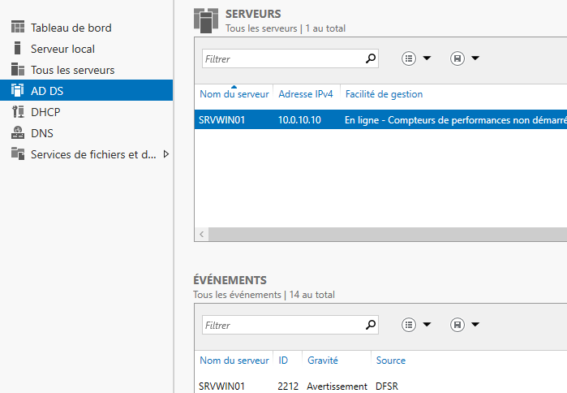
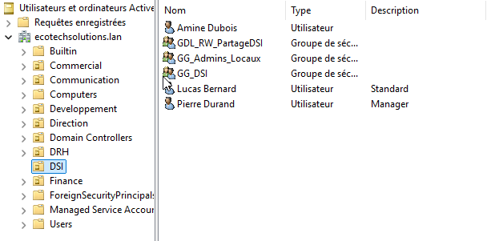
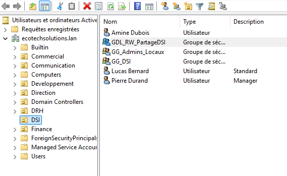
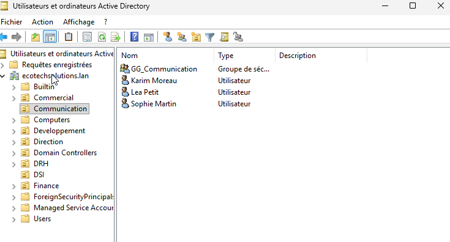
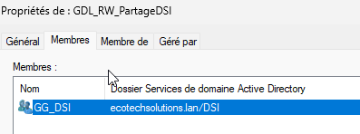
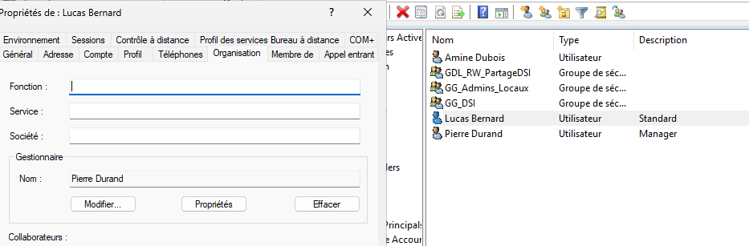

# 02 - Active Directory - SRVWIN01


Le serveur `SRVWIN01` porte le domaine Active Directory `ecotechsolutions.lan`. L'objectif est de remplacer une gestion locale des comptes par une gestion centralisée : utilisateurs, groupes, droits et organisation par services.

Dans une entreprise de cette taille, gérer les comptes directement sur chaque poste ne serait pas maintenable. Active Directory permet de centraliser l'identité, de ranger les objets, d'appliquer des stratégies et de préparer la gestion des droits sur les ressources.

## Serveur Windows utilisé

| Élément | Valeur |
|---|---|
| Nom du serveur | SRVWIN01 |
| Domaine | ecotechsolutions.lan |
| Adresse IP | 10.0.10.10 |
| Rôles visibles | AD DS, DNS, DHCP |



Cette capture montre que `SRVWIN01` est bien intégré au domaine `ecotechsolutions.lan` et qu'il possède l'adresse IP `10.0.10.10`. L'adresse fixe est nécessaire pour un contrôleur de domaine, car les clients doivent toujours savoir où joindre les services AD et DNS.



Le rôle AD DS est visible dans le Gestionnaire de serveur. Cela confirme que le serveur est bien utilisé comme contrôleur de domaine. Le rôle DNS est également présent sur le serveur, ce qui est logique : Active Directory dépend fortement du DNS pour retrouver les contrôleurs de domaine et les services du domaine.

## Organisation des OU

Les OU correspondent aux départements de l'entreprise. Elles servent à ranger les objets de l'annuaire et à faciliter l'administration. Dans ce projet, les captures montrent surtout les OU utilisées pour les comptes créés dans le lab.



L'OU `DSI` contient des utilisateurs standards, un manager et plusieurs groupes de sécurité. Cette organisation permet de séparer clairement les objets du service informatique des autres départements. On retrouve notamment `Lucas Bernard`, `Amine Dubois`, `Pierre Durand`, `GG_DSI`, `GG_Admins_Locaux` et `GDL_RW_PartageDSI`.



Cette vue insiste sur les groupes présents dans l'OU DSI. Les groupes ne servent pas à ranger les utilisateurs comme une OU. Ils servent surtout à attribuer des droits ou à cibler des usages. Par exemple, un groupe global regroupe les utilisateurs d'un service, tandis qu'un groupe de domaine local représente un droit sur une ressource.



L'OU `Communication` contient `Sophie Martin`, `Lea Petit`, `Karim Moreau` et le groupe `GG_Communication`. Cette séparation par département permet de garder une lecture simple de l'annuaire et de montrer que l'organisation n'est pas limitée à un seul service.

## Groupes et AGDLP

Le modèle utilisé est l'AGDLP. La logique est la suivante :

```text
Compte utilisateur -> Groupe global -> Groupe de domaine local -> Permission
```

L'intérêt est d'éviter de donner des droits directement aux utilisateurs. Un utilisateur est placé dans un groupe global lié à son service. Ce groupe global est ensuite ajouté dans un groupe de domaine local qui porte le droit sur une ressource.



Cette capture prouve l'imbrication AGDLP. Le groupe `GG_DSI` est membre de `GDL_RW_PartageDSI`. Concrètement, cela veut dire que les utilisateurs de la DSI héritent du droit associé au groupe de domaine local. Ce fonctionnement est plus propre que de gérer les droits utilisateur par utilisateur.

## Utilisateurs et relation manager

Le sujet demande au moins six utilisateurs, dont deux managers dans deux départements différents et des utilisateurs standards rattachés à ces managers. Dans l'AD, cette relation se renseigne dans les propriétés de l'utilisateur.



Cette capture montre que `Lucas Bernard` a `Pierre Durand` comme responsable. Ce n'est pas seulement cosmétique : l'onglet Organisation permet de représenter la hiérarchie de l'entreprise dans l'annuaire. C'est utile pour la lisibilité, pour les outils qui exploitent l'annuaire et pour prouver que les comptes ne sont pas seulement créés au hasard.

## Résultat obtenu

La brique Active Directory permet maintenant :

- d'avoir un domaine interne `ecotechsolutions.lan` ;
- de centraliser les comptes utilisateurs ;
- de ranger les objets par département ;
- de démontrer une logique AGDLP ;
- de préparer l'application des GPO et l'accès aux ressources.

## Points de contrôle

Les captures montrent la présence du domaine, le rôle AD DS, les OU, les groupes, les utilisateurs et l'imbrication AGDLP. Pour une vérification rapide, on peut également contrôler que les clients utilisent le DNS `10.0.10.10` et qu'ils sont capables d'ouvrir une session avec un compte du domaine.
