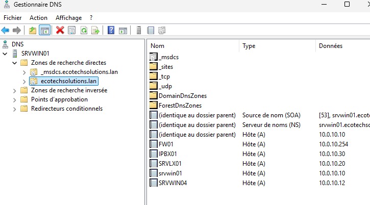
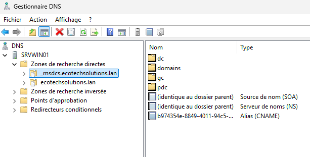
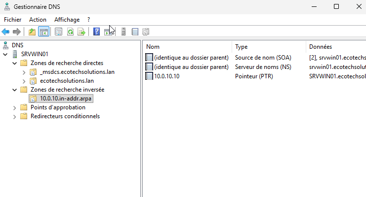
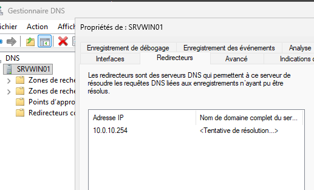
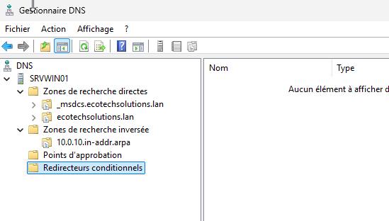
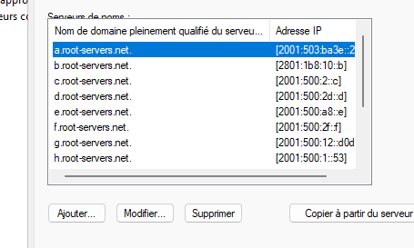
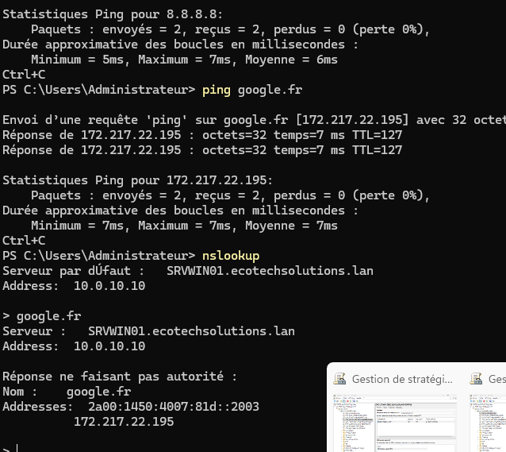

# 04 - DNS - SRVWIN01

## Objectif de la brique

Le serveur DNS est installé sur `SRVWIN01`. Il sert à résoudre les noms du domaine interne `ecotechsolutions.lan` et à transférer les demandes externes vers un redirecteur.

Le DNS est indispensable à Active Directory. Les clients ne se contentent pas de connaître une adresse IP : ils doivent pouvoir retrouver le contrôleur de domaine et les services AD à partir de noms DNS. Sans DNS fonctionnel, l'ouverture de session et la jonction au domaine deviennent instables.

## Zone de recherche directe

La zone directe `ecotechsolutions.lan` contient les enregistrements du domaine interne. Elle permet de résoudre un nom vers une adresse IP. Par exemple, un client peut demander l'adresse de `srvwin01.ecotechsolutions.lan` et obtenir l'adresse du serveur Windows.

Cette zone contient aussi les objets créés automatiquement par Active Directory, en plus des enregistrements ajoutés pour les machines de l'infrastructure. C'est la zone principale pour la résolution interne.

## Zone _msdcs

La zone `_msdcs` est liée au fonctionnement d'Active Directory. Elle contient des enregistrements utilisés par les clients pour localiser les services du domaine, notamment les contrôleurs de domaine. C'est une zone à ne pas supprimer, car elle participe directement au bon fonctionnement de l'AD.

## Zone de recherche inversée

La zone inversée permet de faire le chemin inverse de la zone directe : retrouver un nom à partir d'une adresse IP. Elle n'est pas toujours strictement obligatoire pour un petit lab, mais elle rend l'infrastructure plus propre et facilite certains diagnostics.

Dans ce projet, la zone inverse concerne le réseau `10.0.10.0/24`, c'est-à-dire le LAN où se trouvent le contrôleur de domaine, les clients et les services internes.

## Redirecteur DNS vers pfSense

Le redirecteur est configuré vers `10.0.10.254`, c'est-à-dire l'adresse LAN de pfSense. L'idée est la suivante : si `SRVWIN01` connaît le nom demandé, il répond directement. S'il ne connaît pas le nom, par exemple `google.com`, il transfère la requête vers le redirecteur.

La capture indique une tentative de résolution du nom complet du serveur de redirecteur. Ce n'est pas le plus important ici. Ce qui compte, c'est que l'adresse IP du redirecteur soit renseignée et que les tests de résolution externe fonctionnent ensuite.

## Redirecteurs conditionnels

Les redirecteurs conditionnels sont vides. C'est cohérent avec le projet actuel, car il n'y a pas de second domaine interne ni de domaine partenaire à résoudre vers un DNS spécifique. Le redirecteur général suffit pour les noms externes.

Cette capture évite une confusion fréquente : le redirecteur général et le redirecteur conditionnel ne servent pas exactement au même usage. Ici, le besoin est simple : transférer les requêtes inconnues vers la sortie réseau.

## Indications racine

Les indications racine sont présentes par défaut dans le service DNS Windows. Elles servent de mécanisme de résolution lorsque le serveur DNS doit poursuivre une résolution publique. Dans ce lab, le choix principal reste quand même de passer par le redirecteur configuré.

Cette capture est conservée pour montrer l'état global du serveur DNS et distinguer les indications racine du redirecteur utilisé dans le projet.

## Tests de résolution

Les tests montrent que la résolution DNS fonctionne. `nslookup` permet de vérifier que le serveur DNS répond bien aux requêtes. Les tests internes valident le domaine `ecotechsolutions.lan`, tandis que les tests externes prouvent que les requêtes inconnues peuvent être transférées.

## Résultat obtenu

Le DNS assure deux fonctions :

- résoudre les noms internes du domaine `ecotechsolutions.lan` ;
- transférer les noms externes vers le redirecteur.

Cette brique est directement liée à Active Directory. Les clients du domaine doivent utiliser `10.0.10.10` comme DNS pour trouver correctement le contrôleur de domaine.
