# 05 - DHCP - SRVWIN01

## Objectif de la brique

Le DHCP permet d'attribuer automatiquement une configuration IP aux clients du LAN. Dans ce projet, le rôle DHCP est porté par `SRVWIN01`. Le réseau concerné est le LAN `10.0.10.0/24`.

L'objectif n'est pas seulement de donner une adresse IP. Le DHCP distribue aussi des informations importantes aux clients : la passerelle, le serveur DNS et le nom de domaine. Sans ces options, un client peut recevoir une IP mais ne pas savoir comment sortir du réseau ou comment trouver le domaine Active Directory.

## Rôle DHCP installé

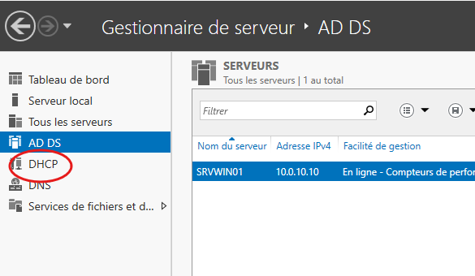

Cette capture montre que le rôle DHCP est bien présent sur le serveur Windows. Le DHCP est centralisé sur `SRVWIN01`, ce qui évite de dépendre d'un DHCP VMware ou d'un DHCP de box. Les clients du LAN récupèrent leur configuration depuis le serveur de l'entreprise.

## Création de l'étendue

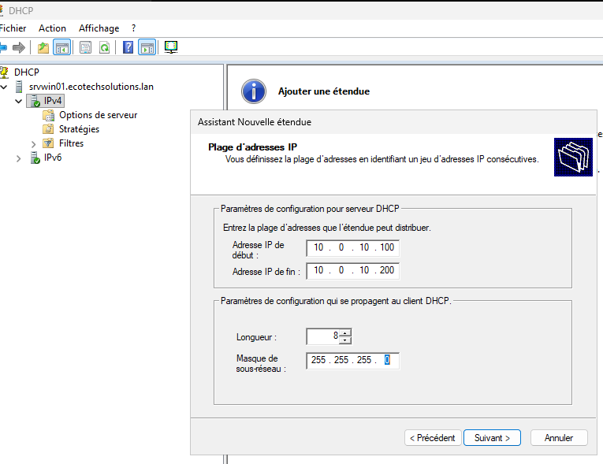

L'étendue correspond à la plage d'adresses que le serveur DHCP peut distribuer. Elle est créée pour le réseau `10.0.10.0/24`. Les adresses fixes des serveurs sont placées en dehors de la plage distribuée afin d'éviter les conflits.

Le principe est simple : les serveurs importants gardent une IP fixe, les clients récupèrent une IP automatiquement.

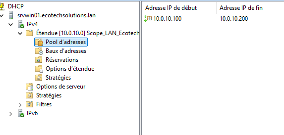

Le pool d'adresses montre les adresses disponibles pour les clients. Cette vue sert à vérifier que la plage est cohérente avec le plan d'adressage du LAN. Elle permet aussi de contrôler que le serveur DHCP ne distribue pas une adresse réservée à un serveur.

## Options d'étendue

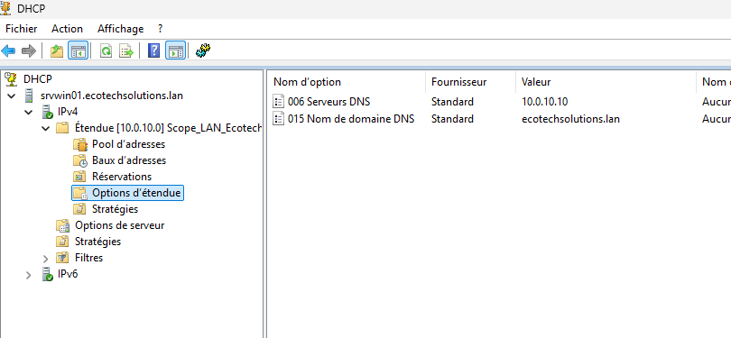

Cette capture montre une étape intermédiaire. À ce moment-là, l'étendue existe, mais toutes les options nécessaires ne sont pas encore présentes. C'est utile à conserver, car cela montre pourquoi les options DHCP ne sont pas un détail.

Une adresse IP seule ne suffit pas. Le client a aussi besoin de connaître sa passerelle par défaut, son serveur DNS et le nom de domaine DNS.

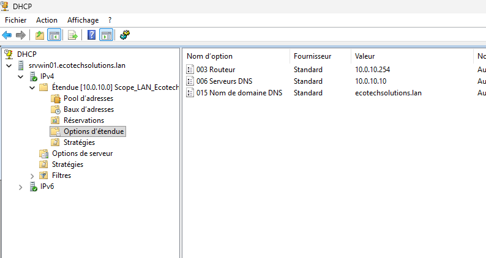

Les options d'étendue complètes indiquent aux clients :

- la passerelle du LAN : `10.0.10.254` ;
- le serveur DNS : `10.0.10.10` ;
- le domaine DNS : `ecotechsolutions.lan`.

C'est ce qui permet à un client de sortir vers Internet via pfSense et de trouver les services du domaine via le DNS de `SRVWIN01`.

## Bail DHCP de CLIWIN01

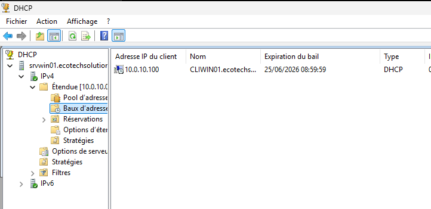

Le bail DHCP confirme qu'un client a bien reçu une adresse depuis l'étendue. Cette preuve est importante parce qu'elle montre que le service fonctionne réellement avec un poste client, pas seulement dans la console de configuration.

## Contrôle réseau sur CLIWIN01

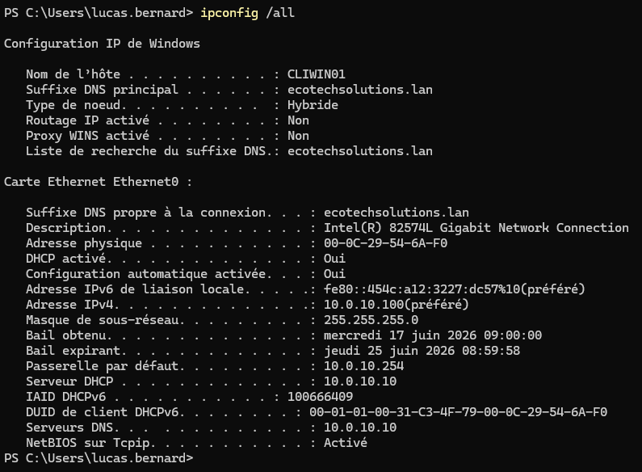

La commande `ipconfig /all` permet de vérifier la configuration reçue par le client. On contrôle l'adresse IPv4, le masque, la passerelle, le serveur DNS et le suffixe DNS. C'est le test le plus direct pour confirmer que les options DHCP sont bien distribuées.

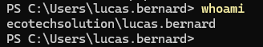

La commande `whoami` permet de vérifier que la session ouverte n'est pas seulement une session locale. Ici, elle sert à confirmer l'utilisation d'un compte du domaine, ce qui complète la validation côté client.

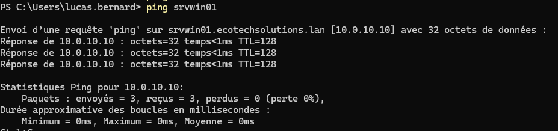

Le ping vers `SRVWIN01` valide la connectivité entre le client et le serveur du domaine. Le client doit pouvoir joindre `10.0.10.10`, car ce serveur fournit les services AD, DNS et DHCP.

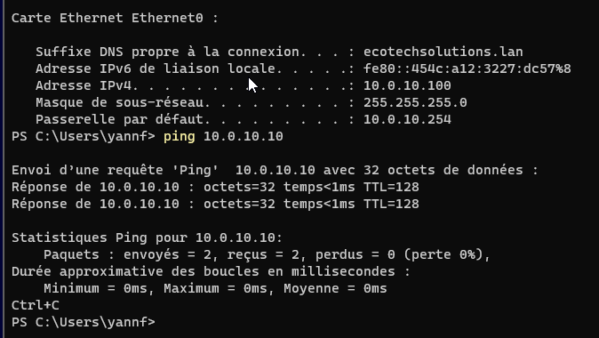

Cette capture regroupe les deux contrôles principaux : la configuration IP du client et la communication avec le serveur Windows. Elle sert de preuve synthétique pour montrer que le client reçoit bien sa configuration et qu'il communique avec l'infrastructure interne.

## Contrôle final de CLIWIN01

Cette capture reprend la configuration de `CLIWIN01` après validation. Elle est conservée comme contrôle final, même si elle recoupe une capture précédente. Dans un projet, garder un contrôle final permet de montrer l'état obtenu après les corrections.

Cette capture confirme de nouveau la session domaine de l'utilisateur. Elle permet de relier le DHCP à la partie Active Directory : le client n'est pas seulement configuré en IP, il est aussi utilisable dans le domaine.

Le ping final montre que la communication avec `SRVWIN01` reste fonctionnelle. C'est une vérification simple, mais utile, car le DHCP, le DNS et l'AD dépendent de cette connectivité.

## Réservation DHCP pour CLIWIN02

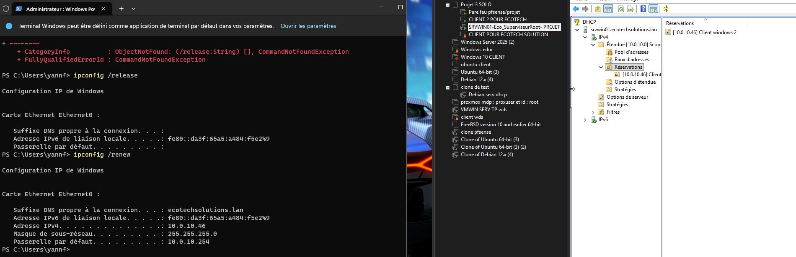

Cette capture montre la réservation DHCP de `CLIWIN02` sur l'adresse `10.0.10.46`. Une réservation permet de garder une adresse stable pour un client sans lui configurer manuellement une IP fixe. C'est pratique pour un poste qui doit rester identifiable tout en continuant à dépendre du DHCP.

La capture montre aussi le renouvellement de la configuration IP. Il y a une tentative de commande mal saisie au début, puis la commande correcte est utilisée. Le résultat important est que le client récupère bien l'adresse réservée.

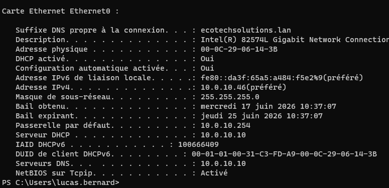

Sur `CLIWIN02`, `ipconfig /all` confirme la configuration reçue. On retrouve l'adresse du client, le suffixe DNS `ecotechsolutions.lan`, la passerelle du LAN et le serveur DNS. Cela prouve que la réservation et les options d'étendue fonctionnent ensemble.

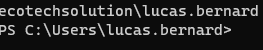

La commande `whoami` confirme que l'utilisateur connecté est `lucas.bernard` dans le domaine. Cette capture relie la partie DHCP à l'objectif client : le poste reçoit sa configuration réseau et peut être utilisé avec un compte AD.

## Résultat obtenu

Le DHCP distribue correctement la configuration réseau du LAN. `CLIWIN01` reçoit une adresse automatiquement, et `CLIWIN02` utilise une réservation. Les clients reçoivent aussi les bonnes options : passerelle, DNS et nom de domaine.

Cette brique valide la base nécessaire pour les postes clients du projet.
