# 06 - GLPI - SRVLX01

GLPI est mis en place pour gérer le parc informatique et suivre les incidents. Dans le projet, il complète l'infrastructure Windows en apportant une interface web pour le support informatique.

Le serveur GLPI est placé sur le LAN avec l'adresse `10.0.10.20`. Il n'est pas exposé directement en DMZ, car c'est un outil interne. Les utilisateurs et techniciens y accèdent depuis le réseau interne.

## Base MariaDB et compte GLPI

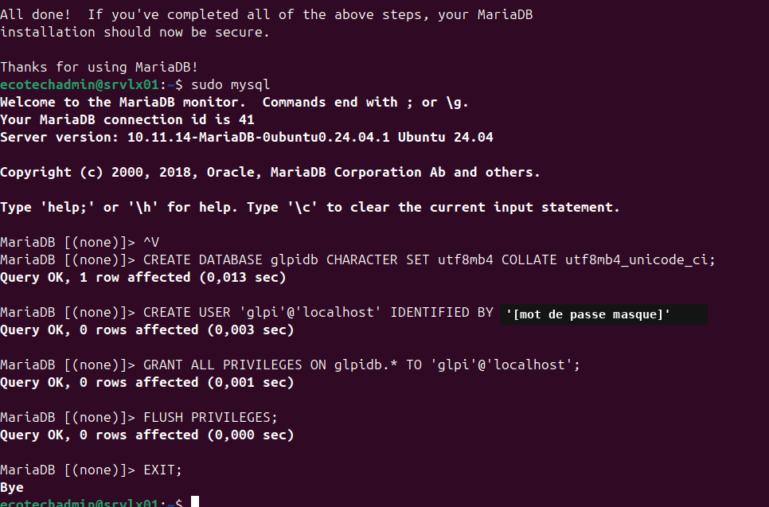

GLPI a besoin d'une base de données pour stocker les tickets, les utilisateurs, le parc, les catégories et l'historique. Cette capture montre la création de la base et du compte utilisé par l'application. Le choix de séparer la base et le compte GLPI évite d'utiliser directement un compte administrateur général pour l'application.

## Problème rencontré lors de la connexion BDD

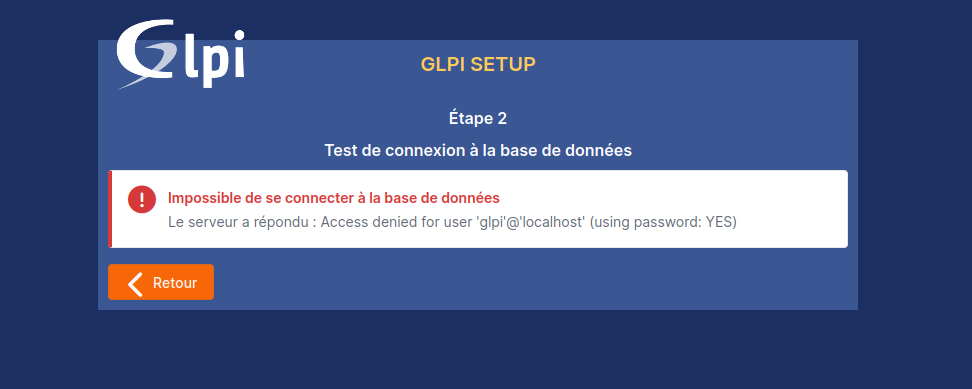

Cette capture montre une erreur rencontrée pendant l'installation. Je la conserve volontairement, car elle explique une étape réelle du déploiement : GLPI ne devient pas fonctionnel seulement parce que les paquets sont installés. La connexion entre l'application web et MariaDB doit être correcte.

L'erreur a été traitée en reprenant les paramètres de connexion à la base : serveur SQL, compte GLPI, mot de passe et droits sur la base. Cette partie est importante dans une documentation, car elle montre aussi la démarche de correction.

## Tableau de bord GLPI fonctionnel

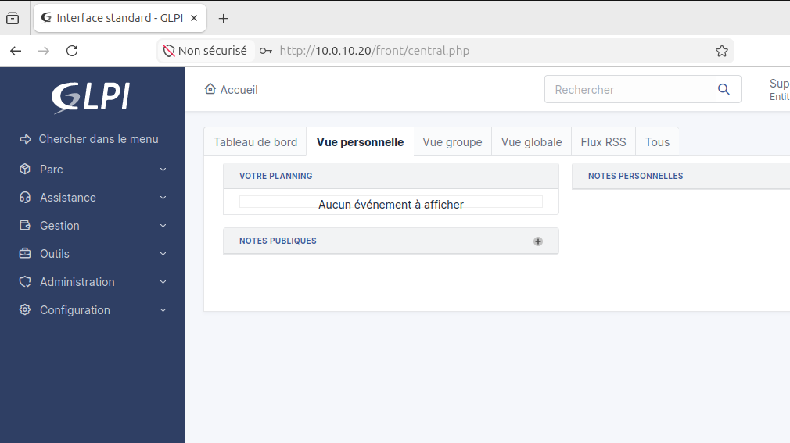

Le tableau de bord confirme que l'installation est terminée et que l'application est accessible en web. C'est la preuve principale de fonctionnement de GLPI : l'interface répond et l'utilisateur peut accéder aux menus de gestion.

## Alertes post-installation

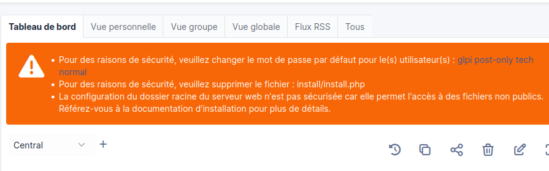

GLPI affiche des alertes après installation. Ces alertes servent à identifier les points de durcissement ou de finalisation. Dans un lab, elles ne bloquent pas forcément la validation fonctionnelle, mais elles doivent être prises en compte pour améliorer la sécurité et la propreté de l'installation.

## Sécurisation des comptes par défaut

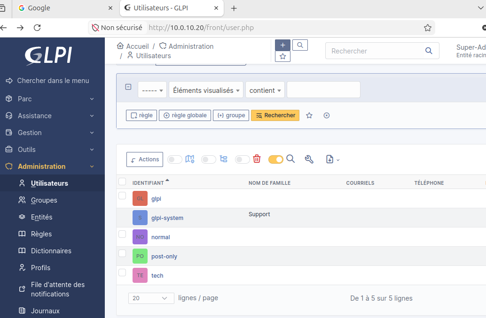

Les comptes par défaut de GLPI ne doivent pas rester avec leurs mots de passe initiaux. Cette capture montre que les comptes internes ont été repris après installation. C'est une étape simple, mais importante, car GLPI contient des informations de parc et des tickets internes.

## Intitulés et référentiels

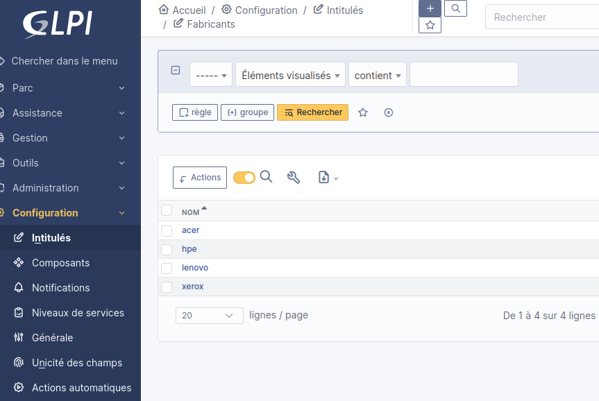

Les intitulés permettent d'organiser les éléments du parc. La capture des fabricants montre que GLPI peut être alimenté avec des informations normalisées. Cela évite d'avoir des noms saisis de manière différente pour un même type d'équipement.

Les statuts servent à suivre l'état des équipements. Par exemple, un matériel peut être en production, en stock, en panne ou retiré. Cette organisation est utile pour donner du sens à l'inventaire au lieu d'avoir seulement une liste d'objets.

## Gestion du parc informatique

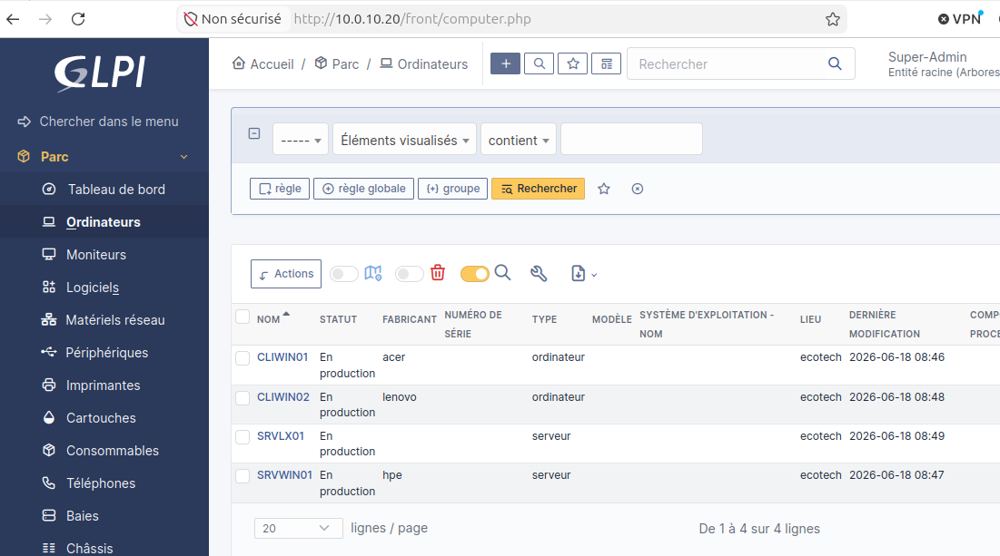

La partie parc contient les ordinateurs et serveurs importants de l'infrastructure. Cette capture montre que GLPI commence à représenter l'environnement du projet, et pas seulement une installation vide.

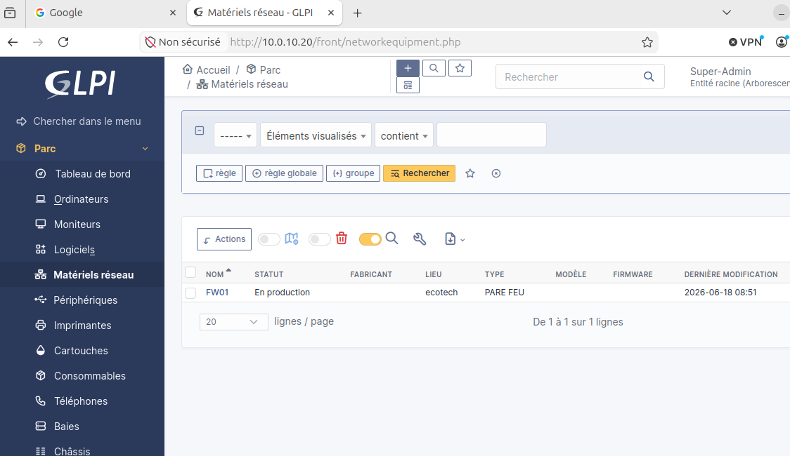

`FW01` est ajouté comme matériel réseau. C'est cohérent avec son rôle central dans l'infrastructure : il est la passerelle du LAN et de la DMZ, et il filtre les flux entre les zones.

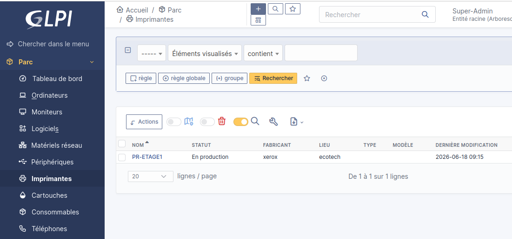

L'ajout d'une imprimante montre que GLPI ne sert pas uniquement aux serveurs. Il peut aussi suivre les périphériques utilisés par les services. Cela rend la gestion de parc plus réaliste.

## Catégories ITIL et utilisateurs

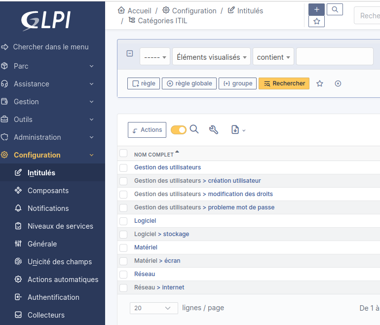

Les catégories ITIL permettent de classer les tickets. Cela facilite le traitement des incidents, car un technicien peut distinguer un problème réseau, matériel, logiciel ou utilisateur. Une bonne catégorisation améliore aussi les statistiques de support.

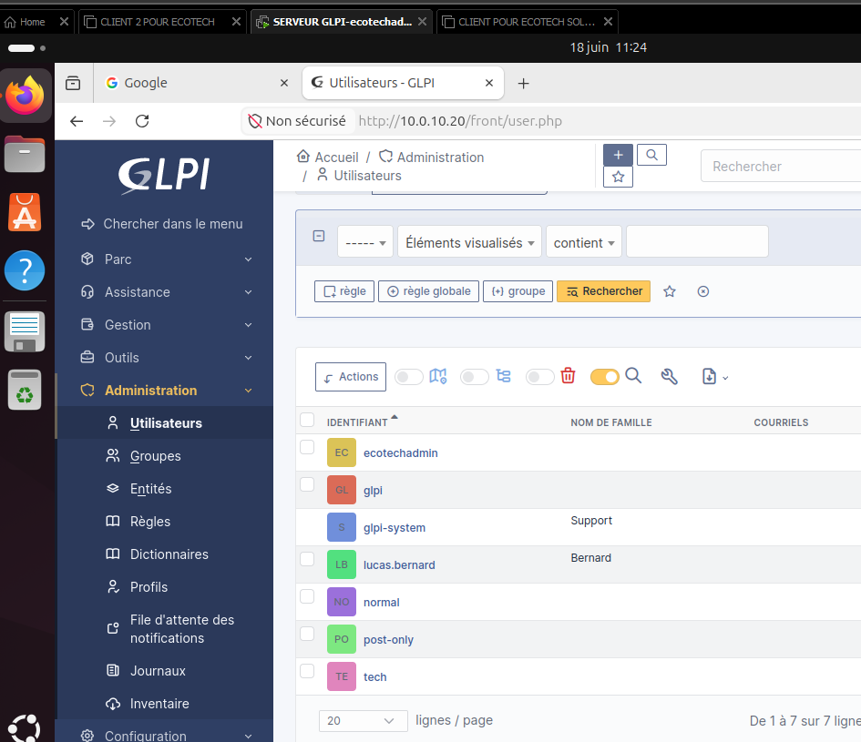

Cette capture montre les utilisateurs créés dans GLPI. On retrouve un utilisateur standard et un profil d'administration. Cette séparation est importante : un utilisateur ne doit pas avoir les mêmes droits qu'un technicien ou qu'un administrateur.

## Cycle de vie d'un ticket

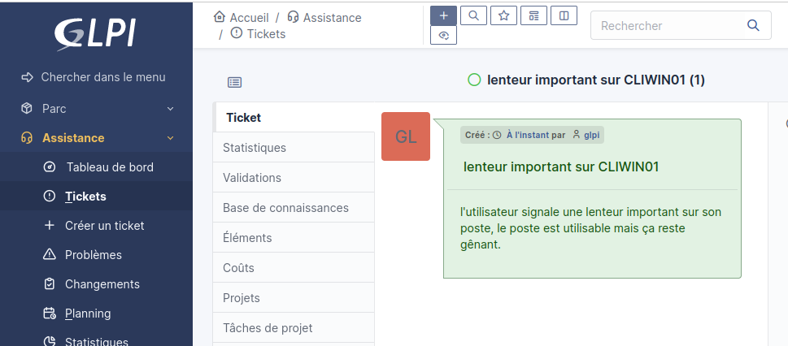

Cette capture montre la création d'un ticket d'incident. C'est le point de départ du processus de support. L'utilisateur déclare un problème, ce qui permet au service informatique de le suivre dans GLPI.

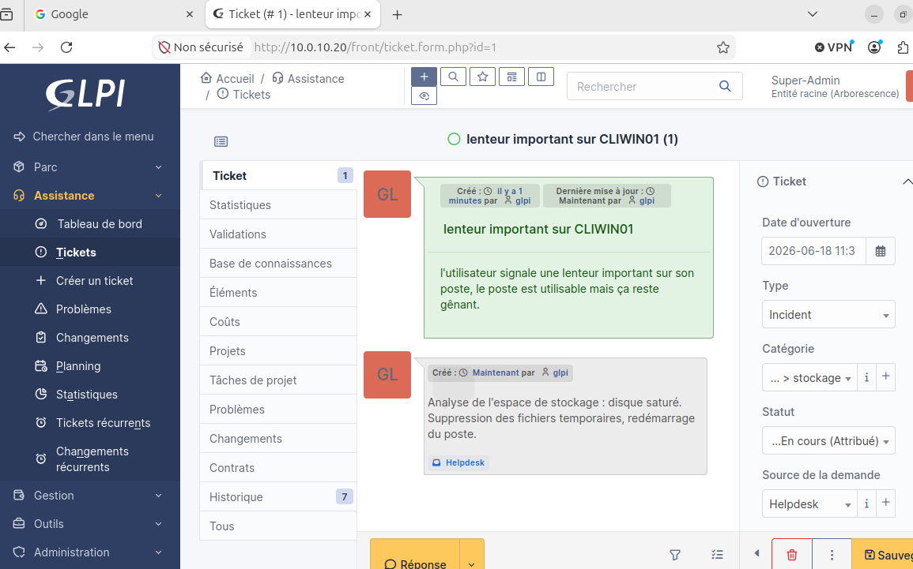

Le ticket passe ensuite dans une phase de suivi. Cette étape montre que le ticket n'est pas seulement créé, mais qu'il peut être pris en charge. GLPI permet de garder une trace des actions réalisées par le support.

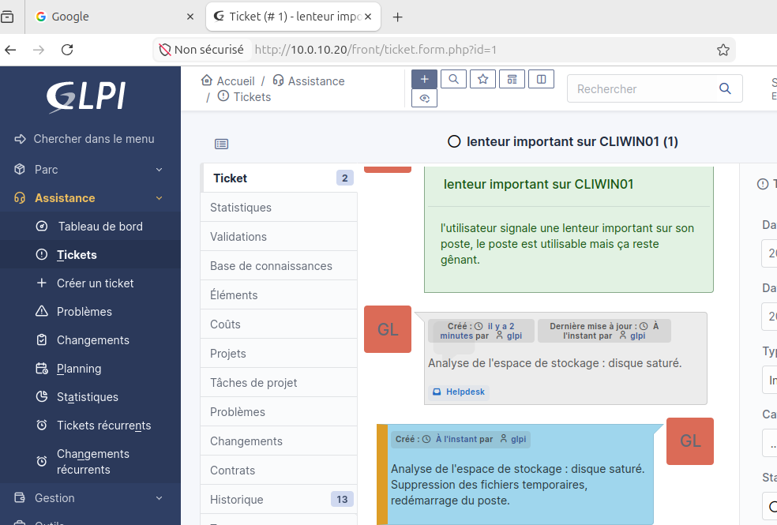

Une solution est ajoutée au ticket. Cette étape documente la réponse apportée au problème. C'est utile pour l'utilisateur, mais aussi pour le service informatique si le même incident revient plus tard.

L'approbation de la solution montre la fin fonctionnelle du traitement. Cela permet de valider que la réponse proposée a bien résolu l'incident.

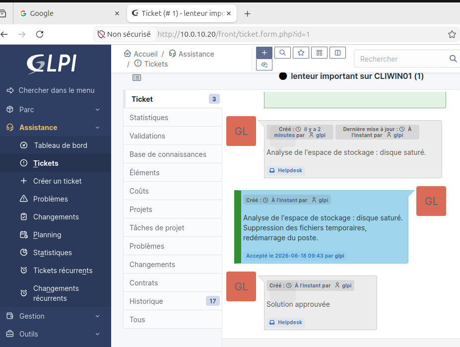

Cette dernière capture confirme l'état final du ticket. Elle sert de preuve complète pour le ticketing : création, suivi, solution et validation.

## Résultat obtenu

GLPI est fonctionnel sur le LAN. Il permet de gérer un début de parc informatique, de créer des utilisateurs, de classer les incidents et de suivre un ticket jusqu'à sa résolution.

