# Mise en place d'un serveur ToIP FreePBX - SERVIPBX01

## 1. Objectif

Ce dossier documente la mise en place de la partie **ToIP** du projet EcoTech Solutions.

L'objectif était de déployer un serveur de téléphonie IP avec **FreePBX / Asterisk**, de créer deux postes SIP internes, puis de valider un appel entre deux utilisateurs depuis des softphones.

Serveur concerné : `SERVIPBX01`  
Système retenu : `Debian GNU/Linux 12 Bookworm`  
Solution téléphonique : `FreePBX 17` avec `Asterisk 22`  
Adresse IP utilisée pendant les tests : `10.0.10.103`  
Type de postes créés : `SIP / PJSIP`

Extensions créées :

| Extension | Utilisateur | Type |
|---|---|---|
| `1001` | Lucas Bernard | PJSIP |
| `1002` | Lea Petit | PJSIP |

---

## 2. Problèmes rencontrés avec l'ISO FreePBX

La première méthode testée a été l'installation avec l'ISO FreePBX/Sangoma. Cette méthode n'a pas été retenue car elle a généré plusieurs blocages pendant l'installation.

### 2.1 Disque trop petit

Lors de la première tentative, le disque virtuel configuré était trop petit. L'installateur indiquait que `6.3 GB` ne suffisait pas et que le partitionnement nécessitait au minimum `10.4 GB`.

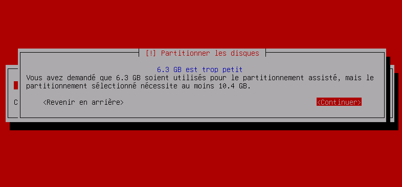

La VM a donc été revue avec un disque plus grand, en visant une taille de `40 Go`, plus adaptée à un serveur FreePBX.

### 2.2 Blocage au script preseed

Même après correction du disque, l'installation via ISO restait bloquée à l'étape `Exécution du script preseed`, autour de `13 %`.

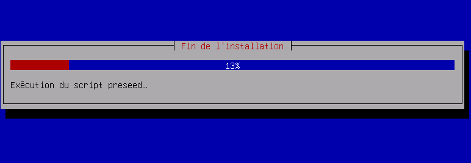

Ce blocage empêchait d'obtenir une installation stable et exploitable.

### 2.3 Mot de passe généré par l'installateur

L'installateur FreePBX/Sangoma affichait aussi un compte système avec un mot de passe généré automatiquement. Cette capture a été conservée uniquement en version masquée, car un mot de passe ne doit pas être publié dans un dépôt GitHub.

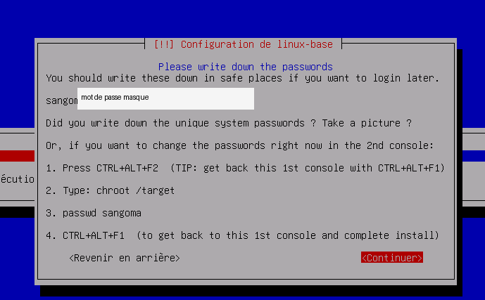

### 2.4 Démarrage bloqué sur GRUB

Après certaines tentatives, la machine redémarrait directement sur une console `grub>`, ce qui confirmait que l'installation via ISO n'était pas propre.

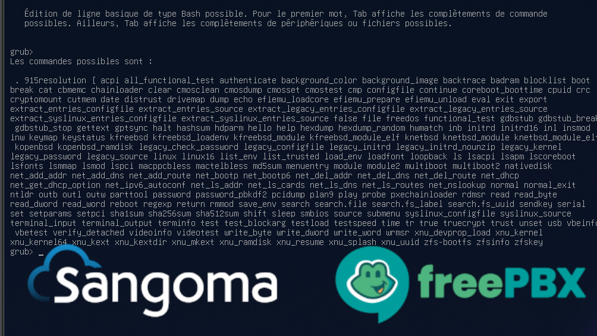

Conclusion : l'ISO FreePBX/Sangoma a été abandonnée. La solution retenue a été une installation propre de Debian 12 Bookworm, puis l'installation de FreePBX avec le script officiel.

---

## 3. Installation de Debian 12 Bookworm

Une nouvelle VM a été créée pour installer une base propre avec Debian 12 Bookworm. Le choix de Debian 12 est important, car le script FreePBX 17 ne supporte pas Debian 13/Trixie.

Pendant l'installation Debian, la participation aux statistiques `popularity-contest` a été refusée.

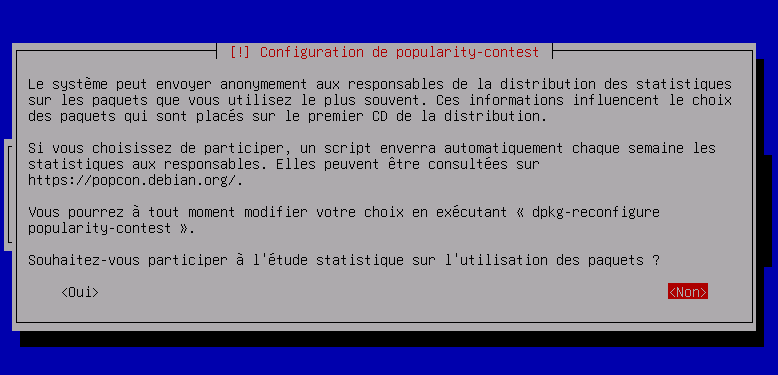

Lors de la sélection des logiciels, l'objectif était d'installer un serveur simple avec SSH et les utilitaires système. Une interface graphique a finalement été installée, mais cela n'a pas bloqué l'installation de FreePBX.

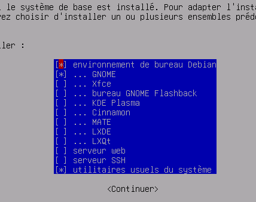

Après installation, la version du système a été vérifiée avec la commande :

```bash
cat /etc/os-release
```

Le résultat confirme que la machine est bien en Debian 12 Bookworm.

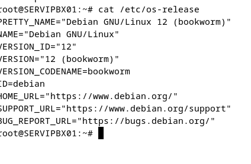

---

## 4. Vérification réseau avant installation de FreePBX

Avant de lancer l'installation de FreePBX, la connectivité réseau a été testée.

Tests réalisés :

```bash
ping 8.8.8.8
ping google.com
hostname
```

Le ping vers `8.8.8.8` valide l'accès Internet en IP. Le ping vers `google.com` valide aussi la résolution DNS.

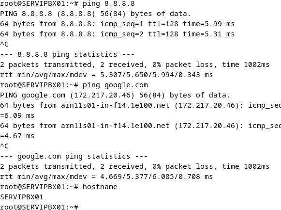

Le serveur était donc prêt pour télécharger les paquets nécessaires à l'installation de FreePBX.

---

## 5. Installation de FreePBX par script officiel

FreePBX a été installé via le script officiel sur Debian 12.

Commandes utilisées :

```bash
apt update
apt install -y wget curl git gnupg ca-certificates
cd /tmp
wget https://github.com/FreePBX/sng_freepbx_debian_install/raw/master/sng_freepbx_debian_install.sh -O /tmp/sng_freepbx_debian_install.sh
chmod +x /tmp/sng_freepbx_debian_install.sh
bash /tmp/sng_freepbx_debian_install.sh
```

Pendant l'installation, plusieurs paquets liés à `Asterisk 22` ont été installés avec succès.

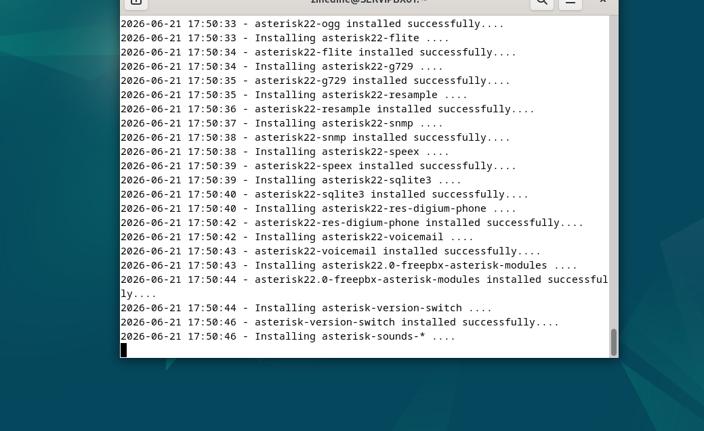

À la fin du script, FreePBX affiche la configuration réseau actuelle. L'interface `ens33` possède l'adresse IP `10.0.10.103`.

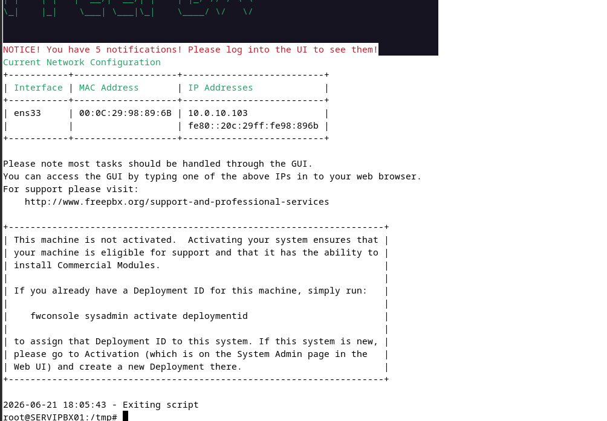

L'installation est considérée comme réussie car le script s'est terminé proprement et l'interface web a été annoncée comme accessible.

---

## 6. Accès à l'interface web FreePBX

Depuis un navigateur, l'interface web a été ouverte avec l'adresse :

```text
http://10.0.10.103
```

La page d'accueil FreePBX est accessible, avec les entrées `FreePBX Administration`, `User Control Panel` et `Get Support`.

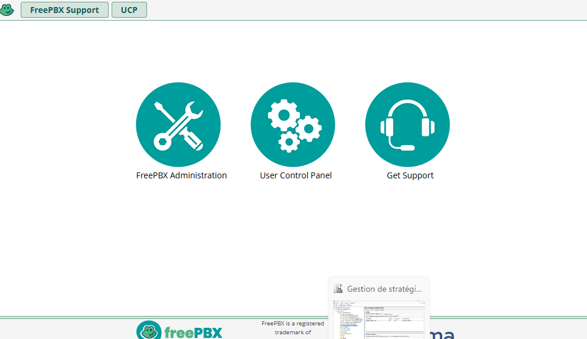

Cela valide que le serveur FreePBX est bien joignable depuis le réseau.

---

## 7. Création des postes SIP / PJSIP

Dans FreePBX, les postes ont été créés depuis la page de gestion des extensions.

Le bon type de poste à choisir est :

```text
Ajout nouveau poste SIP [chan_pjsip]
```

`chan_pjsip` correspond au type PJSIP, adapté aux softphones modernes comme MicroSIP.

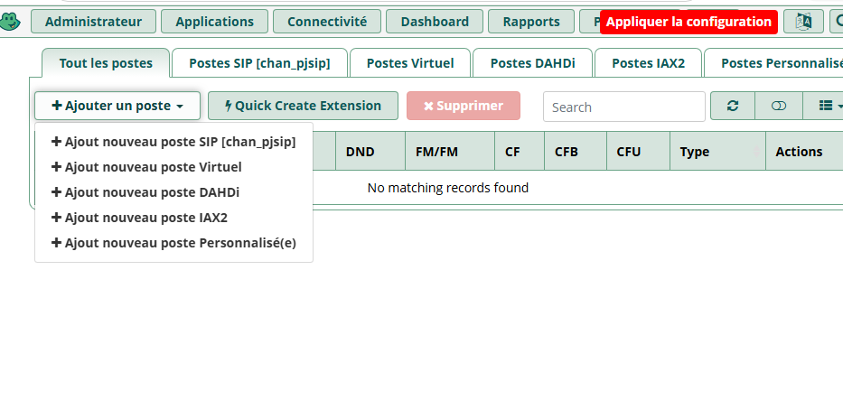

Deux postes ont ensuite été créés :

| Poste | Nom affiché | Type |
|---|---|---|
| `1001` | Lucas Bernard | SIP / PJSIP |
| `1002` | Lea Petit | SIP / PJSIP |

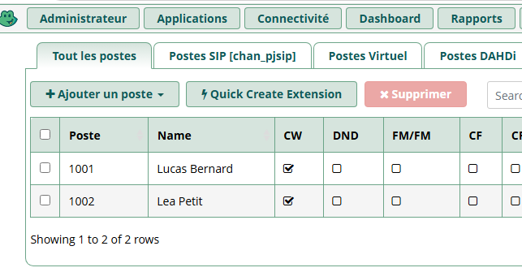

Cette capture prouve que les deux lignes internes existent dans FreePBX.

---

## 8. Configuration des softphones MicroSIP

Pour tester les appels, le softphone **MicroSIP** a été utilisé sur les postes clients Windows.

Un profil MicroSIP a été configuré pour l'utilisateur `Lea Petit`.

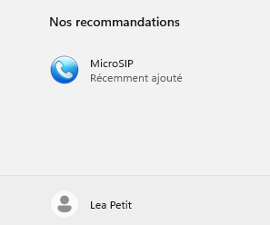

Un autre profil MicroSIP a été configuré pour l'utilisateur `Lucas Bernard`.

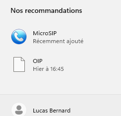

Paramètres généraux utilisés pour les softphones :

| Élément | Valeur |
|---|---|
| Serveur SIP | `10.0.10.103` |
| Extension Lucas Bernard | `1001` |
| Extension Lea Petit | `1002` |
| Type | SIP / PJSIP |

Les mots de passe SIP ne sont pas documentés dans ce dépôt.

---

## 9. Tests d'appel internes

### 9.1 Appel de Lea Petit vers Lucas Bernard

Le poste `1002` associé à Lea Petit appelle le poste `1001` associé à Lucas Bernard.

La capture suivante montre un appel entrant de `Lea Petit` vers `1001`.

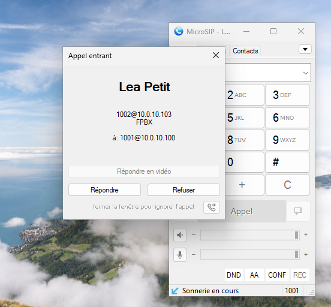

Après réponse, l'appel est connecté sur le softphone du poste `1001`.

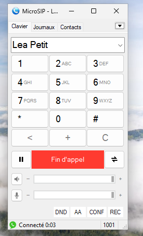

### 9.2 Appel de Lucas Bernard vers Lea Petit

Le test inverse a aussi été réalisé. Le poste `1001` associé à Lucas Bernard appelle le poste `1002` associé à Lea Petit.

La capture suivante montre un appel entrant de `Lucas Bernard` vers `1002`.

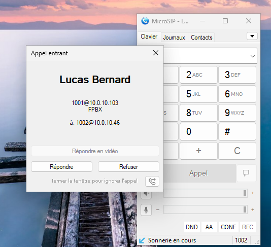

Après réponse, l'appel est connecté sur le softphone du poste `1002`.

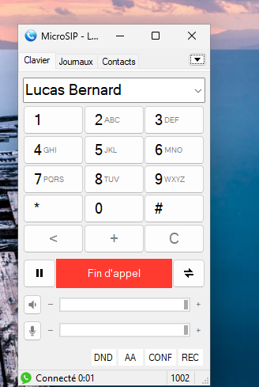

Les appels internes fonctionnent donc dans les deux sens :

```text
1001 → 1002 : OK
1002 → 1001 : OK
```

---

## 10. Résultat final

La partie ToIP est fonctionnelle.

État final :

| Élément | Statut |
|---|---|
| Debian 12 Bookworm installé | OK |
| Accès Internet et DNS | OK |
| FreePBX installé | OK |
| Interface web FreePBX accessible | OK |
| Asterisk 22 installé | OK |
| Poste PJSIP `1001` créé | OK |
| Poste PJSIP `1002` créé | OK |
| MicroSIP configuré | OK |
| Appel `1001 → 1002` | OK |
| Appel `1002 → 1001` | OK |

Conclusion : le serveur `SERVIPBX01` remplit son rôle de serveur ToIP interne pour l'infrastructure EcoTech Solutions.

---

## 11. Limite actuelle

Les appels validés sont des appels internes entre extensions FreePBX.

Le serveur ne permet pas encore d'appeler des numéros publics comme des numéros en `06`, `07`, `01`, etc. Pour cela, il faudrait ajouter un trunk SIP opérateur ou une passerelle GSM.

Pour le projet, ce n'est pas bloquant : l'objectif demandé est de démontrer la mise en place d'une téléphonie interne fonctionnelle.
